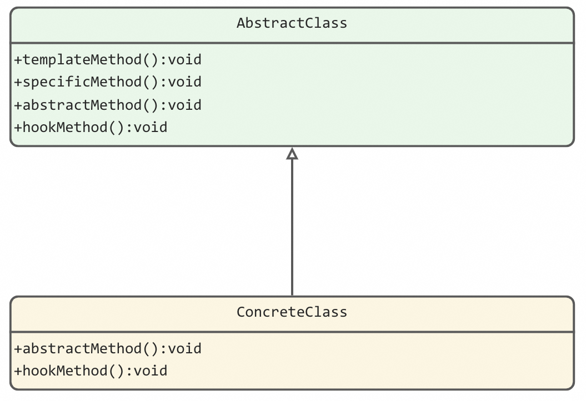

# 6.行为型

### 1.观察者模式

在对象之间定义一个一对多的依赖，当一个对象状态改变的时候，所有依赖的对象都会自动收到通知。

案例：

- Google Guava EventBus
- Spring Event

---

## 2.模板模式

### 2.1.**基本概念**

模板方法模式核心思想是：在抽象类中定义一个任务的算法骨架，将算法的执行细节延迟到子类中个性化实现。子类可以在不改变算法架构的情况下，重新定义特定步骤，甚至干预算法的执行流程，从而起到控制抽象父类行为的作用。

这里的“算法”，可以理解为广义上的“业务逻辑”。在模板模式的经典实现中，模板方法定义为final，可以避免被子类重写。需要子类重写的方法定义为abstract，可以强迫子类去实现。

模板模板有两大作用：

- 复用指的是，所有的子类可以复用父类中提供的模板方法的代码；
- 扩展指的是，框架通过模板模式提供功能扩展点，让框架用户可以在不修改框架源码的情况下，基于扩展点定制化框架的功能；

经典案例：

- Java InputStream
- Java AbstractList
- JdbcTemplate

---

### 2.2.结构

模版方法模式的结构相对简单，主要包含两大类：抽象类、具体类，抽象父类中首先定义好算法流程，具体的步骤细节延迟到具体子类中执行。

| 角色 | 关系 | 作用 |
| --- | --- | --- |
| 抽象类 Abstract Class | 具体类的父类 | 定义一个抽象的模版类，给出算法的骨架，包含一个模版方法和若干个基本方法（抽象方法、具体方法、钩子方法） |
| 具体类 Concrete Class | 抽象构件的接口实现类 | 定义一个具体的实现类，实现抽象类中定义的抽象方法和钩子方法 |

---

### 2.3.使用

step1：创建抽象类，定义一个算法骨架，包含一个模版方法和若干个基本方法：

- 模版方法：算法流程，定义基本方法的执行顺序；
- 基本方法 - 具体方法：在抽象类中实现，可被具体类继承或重写；
- 基本方法 - 抽象方法：在抽象类中声明，由具体类实现；
- 基本方法 - 钩子方法：在抽象类中实现，包含一种用于判断的方法、一种由具体类重写的空方法；

step2：创建具体类，实现抽象类中定义的抽象方法和钩子方法；

---

### 2.4.优缺点及适用场景

**优点：**

1. 封装不变部分， 扩展可变部分。把认为是不变部分的算法封装到父类实现， 而可变部分的则可以通过继承来继续扩展；
2. 提取公共部分代码， 便于维护；
3. 行为由父类控制， 子类实现。基本方法是由子类实现的， 因此子类可以通过扩展的方式增加相应的功能， 符合开闭原则；

**缺点：**

1. 子类执行结果影响父类结果，这违背了我们平时设计代码的习惯，在复杂项目中，很可能会带来阅读上的难度；
2. 可能引起子类泛滥、为了继承而继承的问题；

**适用场景：**

1. 算法的整体步骤相对固定、其中个别方法容易变化时，这时候可以使用模板方法模式，将易变部分抽象出来，供子类实现。
2. 当多个子类存在公共行为时，可以将其提取出来并集中到一个公共父类中以避免代码重复。
3. 当需要控制子类的扩展时，模板方法只在特定点调用钩子操作，即可进行个性化的功能扩展。

---

## 3.策略模式

策略模式定义一组算法类，将每个算法分别封装起来，让它们可以相互替换。策略模式可以使算法的变化独立于使用它们的客户端(调用方)。

策略模式的组成：

- 策略类的定义比较简单，包含一个策略接口和一组实现这个接口的策略类；
- 策略的创建由工厂类来完成，封装策略创建的细节；
- 策略模式包含一组策略可选，客户端代码如何选择使用哪个策略，有两种确定方法：编译时静态确定和运行时动态确定。其中，运行时动态确定才是策略模式最典型的应用场景。

除此之外，我们还可以通过策略模式来移除 if-else 分支判断。实际上，这得益于策略工厂类，借助于“查表法”，根据type查表代替根据type分支判断。

---

## 4.责任链模式

在责任链模式中，多个处理器依次处理同一个请求。一个请求先经过A处理器处理，然后再把请求传递给B处理器，B处理器处理完后再传递给C处理器，以此类推，形成一个链条。链条上的每个处理器各自承担各自的处理职责，所以叫做责任链模式。

责任链模式有两种常用的实现：一种是使用链表来存储处理器，另外一种是使用数组来存储处理器。

典型案例：Servlet Filter、Spring Interceptor；

职责链模式常用在框架开发中，用来实现框架的过滤器、拦截功能，让框架的使用者在不需要修改框架源码的情况下，添加新的过滤拦截功能。

---

## 5.状态模式

状态机又叫有限状态机，由3部分组成：状态、事件、动作。事件也称为转移条件，事件触发状态的转移及动作的执行；不过，状态不是必须的，也可能只转移状态，不执行任何动作。

三种实现方式：

- 分支逻辑法，利用if-else或者switch-case分支逻辑，参照状态转移图，将每一个状态转移原模原样地直译成代码；
- 查表法，对于状态很多、状态转移比较复杂的状态机来说，查表法比较合适。通过二维数组来表示状态转移图；
- 状态模式，对于状态并不多、状态转移也比较简单，但事件触发执行的动作包含的业务逻辑可能比较复杂的状态机来说，首选这种方式。

---